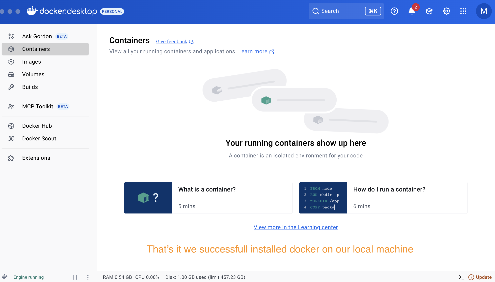
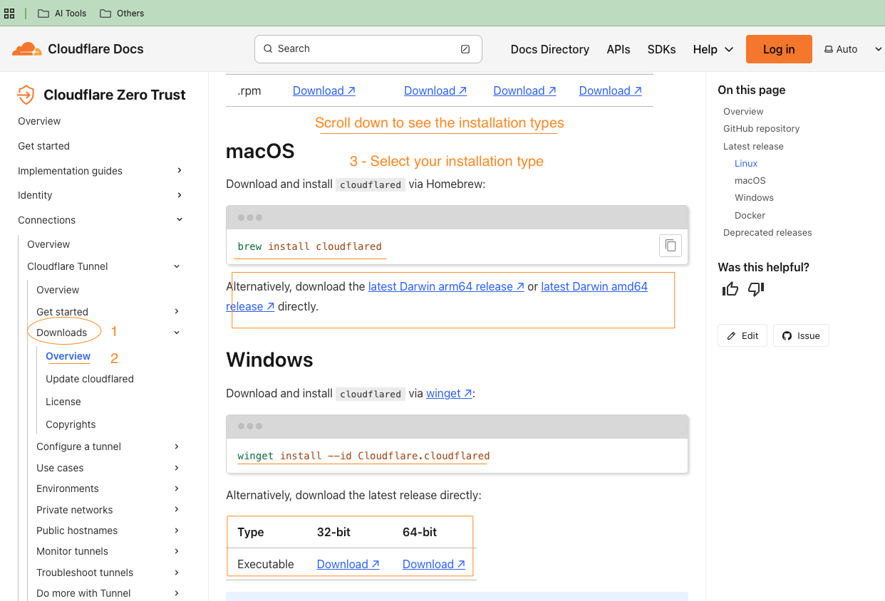

---

# N8N Local Installation Guide

## ✨ Overview

This guide provides a straightforward, three-step process for installing a local, self-hosted version of N8N, a powerful workflow automation tool. Unlike complex traditional methods that involve intricate DNS and Cloudflare tunnel setups, this approach is designed for beginners. By using a community-developed installer called **Cribops CLI**, you can quickly get N8N running on your machine with all its features, including the ability to connect to external services via HTTPS. This setup ensures your data remains on-premise, offers a free alternative to N8N's cloud product, and is ideal for enterprises that require local hosting.

## 📝 Notes

### Step 1: Secure a Domain Name

- **Action:** Register a domain name through Cloudflare.
- **Key Detail:** The only cost associated with this process is the annual domain registration fee (approximately $10).
- **Pro-Tip:** Cloudflare is recommended for its simple, affordable domain registration.


### Step 2: Install Prerequisites

This step involves setting up the necessary tools to prepare your system for the N8N installation.

- **Docker Desktop:** Install Docker Desktop for your operating system (Mac or Windows) and sign in or create an account.

```
https://docs.docker.com/
```




- **Cloudflared:** Install `cloudflared`, a command-line tool that enables a secure connection between Cloudflare and your local machine.

-Documentation

```
https://developers.cloudflare.com/cloudflare-one/connections/connect-networks/downloads/
```



- I will use brew to install the Cloud Flare CLI

  ```bash
  /bin/bash -c "$(curl -fsSL https://raw.githubusercontent.com/Homebrew/install/HEAD/install.sh)"
  ```


- Cloudflare CLI installation using brew


- **Cribops CLI:** Download and install the Cribops CLI installer from the official documentation. This tool simplifies the entire N8N setup process.

```
https://github.com/CloudBedrock/cribops-docs
```


- Installation


### Step 3: Install N8N

This is the final step, where you use a few simple commands to get N8N up and running.

- **Main Command:** Run a one-line setup command in your terminal, which leverages the Cribops CLI to configure everything for you.
- **Customization:** You must replace the example tunnel and domain names with your own unique values.
- **Finalization:** Use the `docker compose up -d` command to pull and run all the necessary components, including N8N and a PostgreSQL database.

## 🚀 Installation

This section provides the specific commands for a successful installation.

### Prerequisites

Before you begin, ensure you have completed the following:

- **Docker Desktop:**
- **Cloudflared:**
- **Cribops CLI:**

### Installation Steps

1.  Open your terminal and run the Cribops setup command. Replace `<your_tunnel_name>` with a unique name and `<your_domain.com>` with the domain you registered.

    ```bash
    cribops-cli setup --cloudflare-tunnel --tunnel-name <tunnel name> --tunnel-hostname <Your domain name>

    ```


2.  After the setup is complete, run the following command to finalize the installation and start all services.

    ```bash
    docker compose up -d
    ```


3. Next test and run N8N.

### Troubleshooting

- If you encounter an error with Cloudflare, you can restart the Docker containers.
- Run `docker compose down` to stop the services.
- Then, run `docker compose up -d` again to restart and ensure a clean installation.

### Post-Installation

## ✅ Summary

This guide simplifies the process of installing N8N locally, making it accessible to anyone. By following these clear, sequential steps, you can set up a secure, self-hosted N8N environment on your machine. This method is the fastest and most efficient way to get started with N8N and begin building powerful automations.
